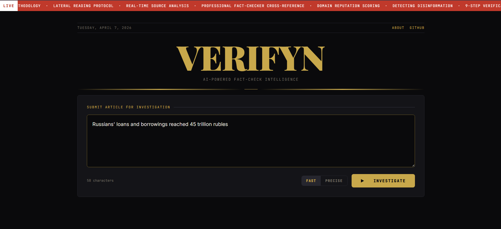

# Verifyn — AI Fact-Check Engine

An autonomous AI agent that classifies news as **REAL**, **FAKE**, **MISLEADING**, **PARTIALLY_FAKE**, **UNVERIFIABLE**, **SATIRE**, or **NO_CLAIMS** — with evidence, sources, and step-by-step reasoning. Exposes a REST API with a web frontend.

**→ [github.com/khodossss/verifyn](https://github.com/khodossss/verifyn)**

---

## Why This Agent

Most "fake news detectors" are binary classifiers trained on static datasets. They score a text against patterns learned months ago and give you a number. They cannot look anything up.

**Verifyn works differently:**

| Feature | Typical classifier | Verifyn |
| --- | --- | --- |
| Verdict options | Real / Fake | REAL, FAKE, MISLEADING, PARTIALLY_FAKE, UNVERIFIABLE, SATIRE, NO_CLAIMS |
| Evidence | None | Structured `evidence_for` and `evidence_against` with source URLs |
| Sources | None | Live web search + professional fact-checker cross-reference |
| Methodology | ML heuristics | 9-step methodology used by professional journalists |
| Manipulation type | None | 9 types: FABRICATED, CONTEXT_MANIPULATION, OLD_CONTENT_RECYCLED, … |
| Explainability | Score only | Full step-by-step reasoning narrative + plain-language summary |
| Freshness | Frozen at training | Searches the live web — handles breaking news |
| Source memory | None | Self-learning domain reputation DB — builds a trust map of sources over time |
| Query memory | None | Embedding-based similarity search — finds previously checked claims instantly |

The core is a [ReAct](https://arxiv.org/abs/2210.03629) agent (Reason → Act → Observe → Repeat) built with **LangGraph** that autonomously decides which tools to call and in what order — until it has enough evidence to reach a verdict.

---

## How It Works

> **Full architecture details:** [docs/AGENT_ARCHITECTURE.md](docs/AGENT_ARCHITECTURE.md)

### ReAct Research Loop

```text
                News text
                    │
                    ▼
┌─────────────────────────────────────────┐
│               ReAct Agent               │
│                                         │
│       Think → pick tool → call tool     │
│         ↑                      │        │
│         └──── observe result ◄─┘        │
│                                         │
│          Stops when confident           │
└─────────────────────────────────────────┘
                    │
                    ▼
               Final message 
```

The agent follows a 9-step fact-checking methodology:

| Step | Action |
| --- | --- |
| 1 | **Search previous fact-checks** — embedding similarity search over query history |
| 2 | Extract specific, verifiable claims from the text |
| 3 | Find the **primary source** — original document, transcript, or official statement |
| 4 | Check **date and context** — is the quote/statistic shown in full? |
| 5 | **Lateral reading** — 3–5 independent external sources, not just the original site |
| 6 | Count independent **confirmations or refutations** |
| 7 | Detect **recycled content** — old photos or quotes repackaged as new |
| 8 | Search **professional fact-checkers**: Snopes, PolitiFact, Reuters, AFP, Full Fact |
| 9 | Classify manipulation type and calibrate confidence |

### Tools Available to the Agent

| Tool | Purpose |
| --- | --- |
| `search_similar_queries(query)` | Embedding similarity search in query history (Step 1) |
| `web_search(query)` | Lateral reading via Tavily (DuckDuckGo fallback) |
| `search_fact_checkers(claim)` | Scoped search on Snopes, PolitiFact, Reuters, AFP, Full Fact |
| `check_if_old_news(claim)` | Detect recycled content by finding earliest appearances |
| `extract_article_content(url)` | Fetch full article text, author, date via trafilatura |
| `check_domain_reputation(domain)` | DB-learned credibility score + web reputation search |

### Domain Reputation Database

> **Full schema and scoring rules:** [docs/DATA_STORAGE.md](docs/DATA_STORAGE.md)

The agent **learns from its own verdicts** over time. After each fact-check, every source domain referenced in evidence is scored:

```text
                  Verdict
                     │
      ┌──────────────┼──────────────┐
      ▼              ▼              ▼
   evidence_for  evidence_against  sources_checked
      │              │              │
      └──────────────┼──────────────┘
                     ▼
         Extract domains from URLs
                     │
                     ▼
         Apply scoring table (verdict × supports_claim)
                     │
                     ▼
         Upsert domain_reputation DB
```

**Scoring rules** — each source gets points based on verdict and whether it supported or contradicted the claim:

| Verdict | Source supported claim | Source contradicted claim |
| --- | --- | --- |
| REAL | true +1.0 | false +1.0 |
| FAKE | false +1.0 | true +1.0 |
| PARTIALLY_FAKE | +0.5 / +0.5 | +0.5 / +0.5 |
| MISLEADING | true +0.3, false +0.7 | true +0.7, false +0.3 |
| SATIRE / UNVERIFIABLE | no change | no change |

In **fast mode** all scores are multiplied by 0.5 (fewer sources checked = less reliable signal).

**Credibility threshold:** once a domain accumulates 50+ total points, its credibility score is computed:

```python
credibility = true_points / (true_points + false_points)
```

The `check_domain_reputation` tool queries this DB first. If a domain is above threshold, the web reputation search is skipped entirely — the agent trusts its own accumulated data.

**Query history:** every fact-check is saved with its full result JSON and an **embedding vector**, enabling similarity search and analysis of past verdicts. Accessible via `GET /history`.

**Research potential:** as the agent processes more claims and its verdict accuracy improves, the domain reputation database becomes a valuable byproduct — an empirically derived trust map of news sources. With high agent accuracy, the accumulated credibility scores can serve as an independent, data-driven source reliability index built from real fact-checking activity rather than editorial judgment.

### Similarity Search (Step 1)

> **Embedding model, mode logic, FAISS migration path:** [docs/SIMILARITY_SEARCH.md](docs/SIMILARITY_SEARCH.md)

Before running any web searches, the agent checks whether a similar claim has already been fact-checked. This is the **very first step** in the 9-step methodology.

```text
New query → compute embedding (OpenAI text-embedding-3-small)
                │
                ▼
        Cosine similarity search over query_history
                │
        ┌───────┴───────┐
        ▼               ▼
   Match found      No match
   (sim ≥ 0.75)        │
        │               └──→ Continue with Steps 2–9
        ▼
   Agent evaluates:
   - Is previous result still current?
   - Has the event evolved?
   - Adopt or verify with fresh search
```

**Mode-aware filtering:**

- In `fast` mode → accepts both `precise` and `fast` previous results
- In `precise` mode → accepts only `precise` previous results

**Why not FAISS?** At current scale (hundreds to low thousands of queries), brute-force cosine similarity via numpy is ~1ms per search. FAISS adds C++ build complexity for zero practical benefit. The architecture supports migration to FAISS at >50K queries — only `find_similar_queries()` needs changing.

**Embeddings:** stored as JSON arrays in SQLite alongside each query result. Model: `text-embedding-3-small` (1536 dims, ~$0.00002/query).

---

## Web Frontend — Verifyn

> **Frontend stack, SSE handling, Nginx config:** [docs/WEBSITE.md](docs/WEBSITE.md)

Web interface served by Nginx at port 3000.

**Start it:**

```bash
docker compose up --build
# Open http://localhost:3000
```

**UI overview:**




---

## Evaluation

> **Methodology, per-dataset analysis, soft-scoring justification:** [docs/EVALUATION.md](docs/EVALUATION.md)

The agent was benchmarked against five public fake-news datasets, balanced 16 REAL + 16 FAKE per dataset (32 items each, 160 total), running with `gpt-5-nano-2025-08-07`, concurrency 20, no DB caching.

To separate "agent got it wrong" from "agent's taxonomy is finer than the dataset's", the same runs were re-scored with:

- `REAL` → REAL
- `FAKE | MISLEADING | PARTIALLY_FAKE | SATIRE` → FAKE
- `UNVERIFIABLE | NO_CLAIMS | ERROR` → excluded from scoring (selective-prediction convention)

| Dataset | Strict acc | **Soft acc** | Soft F1 | Scored | Excluded |
|---------|----------:|-------------:|--------:|-------:|---------:|
| **FEVER** | 69% | **92%** | 0.92 | 25/32 | 7 |
| WELFake | 38% | **89%** | 0.86 | 18/32 | 14 |
| FakeNewsNet PolitiFact | 41% | **84%** | 0.84 | 19/32 | 13 |
| LIAR | 28% | **78%** | 0.81 | 18/32 | 14 |
| FakeNewsNet GossipCop | 34% | **69%** | 0.58 | 16/32 | 16 |

Per-dataset reports: [`docs/reports/<dataset>.md`](docs/reports/) (strict) and `<dataset>_soft.md` (soft). Run any single benchmark with:

```bash
python -m agent.eval.scripts.eval_fever
python -m agent.eval.scripts.eval_liar
python -m agent.eval.scripts.eval_welfake
python -m agent.eval.scripts.eval_fakenewsnet_politifact
python -m agent.eval.scripts.eval_fakenewsnet_gossipcop
python -m agent.eval.scripts.rescore_soft   # regenerate _soft.md from existing JSON
```

---

## Setup

> **Docker Compose, CI, env vars, deployment:** [docs/INFRASTRUCTURE.md](docs/INFRASTRUCTURE.md)

### Prerequisites

- Docker + Docker Compose (recommended), **or** Python 3.11+
- **LLM API key** — one of the supported providers:
  - **OpenAI** (`OPENAI_API_KEY`) — [platform.openai.com](https://platform.openai.com)
  - **Anthropic** (`ANTHROPIC_API_KEY`) — [console.anthropic.com](https://console.anthropic.com)
  - **Ollama** (no key needed) — [ollama.ai](https://ollama.ai), runs locally
  - Set `LLM_PROVIDER` in `.env` to choose (`openai` / `anthropic` / `ollama`)
- **TAVILY_API_KEY** *(optional)* — from [app.tavily.com](https://app.tavily.com) for enhanced search. Set `TAVILY_USE=false` to use DuckDuckGo instead (no key needed)

### 1. Clone & configure

```bash
git clone https://github.com/khodossss/verifyn.git
cd verifyn/fake_news_detection
cp .env.example .env   # then fill in your API keys
```

### 2. Run with Docker Compose (recommended)

```bash
docker compose up --build
```

- Frontend: `http://localhost:3000`
- Backend API: `http://localhost:8000`
- API docs: `http://localhost:8000/docs`

### 3. Run without Docker

```bash
pip install -r requirements.txt
uvicorn backend.main:app --host 0.0.0.0 --port 8000 --reload
# Open website/index.html directly in a browser
```

### 4. CLI usage

```bash
python agent/run.py --text "NASA confirmed drinking bleach cures COVID-19"
python agent/run.py --file article.txt --verbose
python agent/run.py --json --text "..."
```

### 5. Use as a Python library

```python
from dotenv import load_dotenv
load_dotenv()

from agent import analyze_news

result = analyze_news("Your news text here")
print(result.verdict)           # Verdict.FAKE
print(result.confidence)        # 0.95
print(result.manipulation_type) # ManipulationType.FABRICATED
print(result.summary)
```

---

## Output Schema

```python
class FactCheckResult(BaseModel):
    verdict: Verdict              # REAL | FAKE | MISLEADING | PARTIALLY_FAKE | UNVERIFIABLE | SATIRE | NO_CLAIMS
    confidence: float             # 0.0 – 1.0
    confidence_level: str         # HIGH (≥0.8) | MEDIUM (≥0.5) | LOW (<0.5)
    manipulation_type: str        # FABRICATED | CONTEXT_MANIPULATION | OLD_CONTENT_RECYCLED |
                                  # MISLEADING_HEADLINE | PARTIAL_TRUTH | SATIRE_MISREPRESENTED |
                                  # COORDINATED_DISINFO | IMPERSONATION | NONE

    main_claims: list[str]
    primary_source: str | None
    date_context: str | None

    evidence_for: list[EvidenceItem]
    evidence_against: list[EvidenceItem]
    fact_checker_results: list[str]
    sources_checked: list[str]

    reasoning: str   # full 9-step walkthrough
    summary: str     # 2–4 sentence plain-language verdict
```

---

## Project Structure

```text
fake_news_detection/
├── docker-compose.yml
├── requirements.txt
├── .env.example
├── ruff.toml                  # Linter/formatter config
├── .pre-commit-config.yaml    # Pre-commit hooks (ruff + tests)
├── .github/workflows/ci.yml   # GitHub Actions CI (lint, test, docker build)
│
├── backend/
│   ├── main.py                # FastAPI app — POST /analyze, /analyze/stream, /history
│   ├── tests/                 # 63 API + model tests
│   └── Dockerfile
│
├── website/
│   ├── index.html             # Web UI
│   ├── css/                   # Modular CSS (variables, ticker, masthead, results…)
│   ├── js/                    # Modular JS (app.js, render.js, loading.js…)
│   ├── nginx.conf
│   └── Dockerfile             # Nginx static server
│
├── data/                      # SQLite DB (domain reputation + query history + embeddings)
│
├── migrations/                # Versioned DB migration scripts
│   ├── 001_drop_query_hash_add_embedding.py
│   └── 002_backfill_embeddings.py
│
├── docs/                      # Architecture documentation
│   ├── AGENT_ARCHITECTURE.md
│   ├── SIMILARITY_SEARCH.md
│   ├── BACKEND.md
│   ├── DATA_STORAGE.md
│   ├── WEBSITE.md
│   ├── EVALUATION.md
│   └── INFRASTRUCTURE.md
│
└── agent/
    ├── agent.py               # analyze_news() — ReAct loop + Pydantic extraction
    ├── models.py              # FactCheckResult, Verdict, ManipulationType
    ├── db.py                  # Domain reputation + query history + embeddings (SQLAlchemy)
    ├── run.py                 # CLI entry point (Rich terminal UI)
    ├── evaluate.py            # Evaluation on LIAR, FEVER, FakeNewsNet benchmarks
    ├── prompts/
    │   └── system.py          # 9-step methodology system prompt
    ├── tools/
    │   ├── search.py          # web_search, search_fact_checkers, check_if_old_news
    │   ├── extractor.py       # extract_article_content
    │   ├── domain.py          # check_domain_reputation (DB + web search)
    │   └── similarity.py      # search_similar_queries (embedding cosine similarity)
    ├── eval/
    │   ├── dataset.json       # 20 labeled news items (smoke test)
    │   ├── adapters.py        # LIAR, FEVER, FakeNewsNet dataset loaders
    │   └── metrics.py         # Confusion matrix, F1, classification report
    └── tests/
        ├── unit/              # Fast, fully mocked (284 tests)
        ├── integration/       # Real DB + tools, mocked LLM (7 tests)
        └── e2e/               # Real LLM + API calls (18 tests, --run-e2e)
```

---

## Key Design Decisions

**Why a ReAct agent?**
A fixed chain cannot adapt — if a source is paywalled, the agent tries another. If a claim needs more lateral reading, it searches again. The graph structure lets the agent reason about whether it has enough evidence before stopping.

**Why Tavily instead of Google/Bing?**
Tavily returns pre-extracted text optimised for LLM consumption and supports `search_depth="advanced"` to fetch full page content — no additional scraping needed.

**Why lateral reading?**
Research by the Stanford History Education Group shows that reading a source in isolation (vertical reading) is less reliable than immediately checking what *other* sources say about it. Professional fact-checkers use the same approach.

**Why is UNVERIFIABLE a valid verdict?**
Forcing a binary true/false when evidence is insufficient creates false confidence. If the agent cannot find enough independent corroboration, UNVERIFIABLE is the honest answer.
